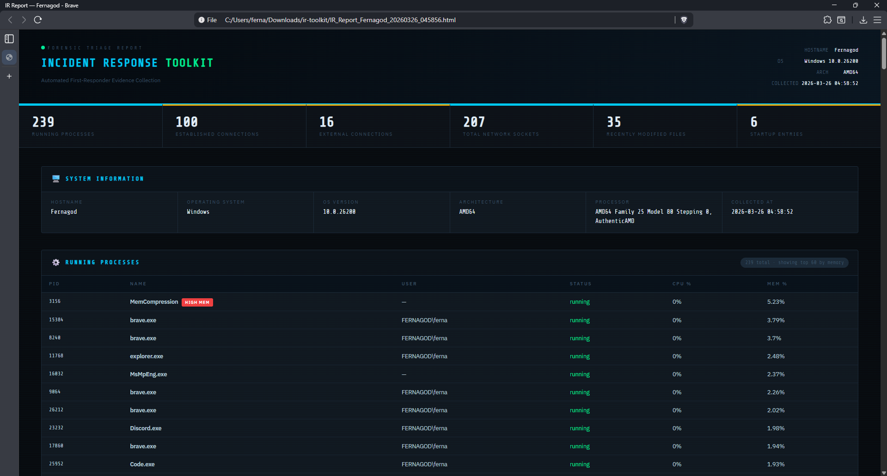
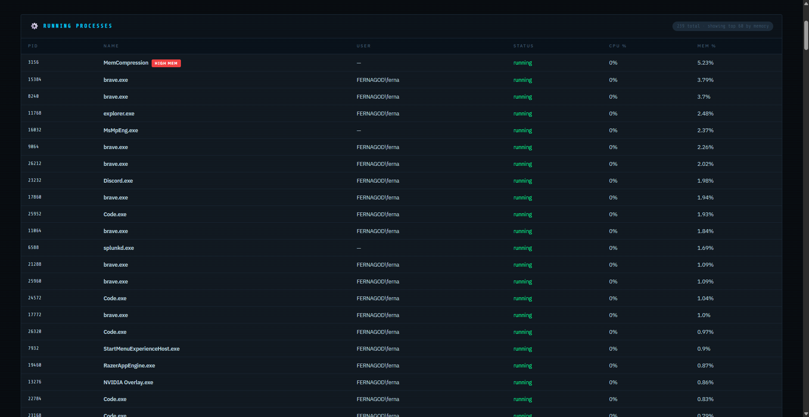
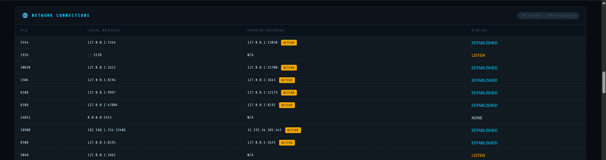
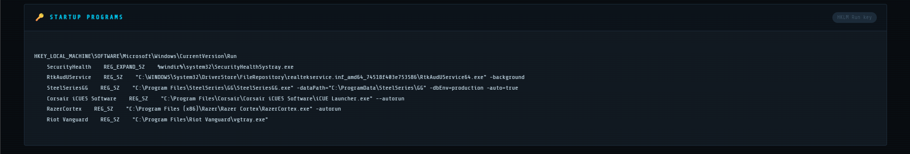
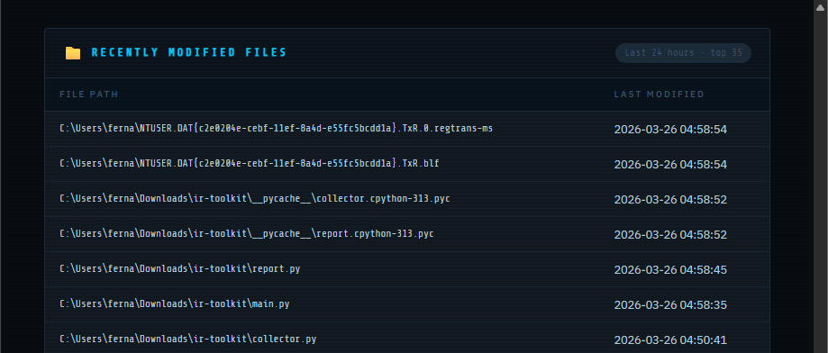
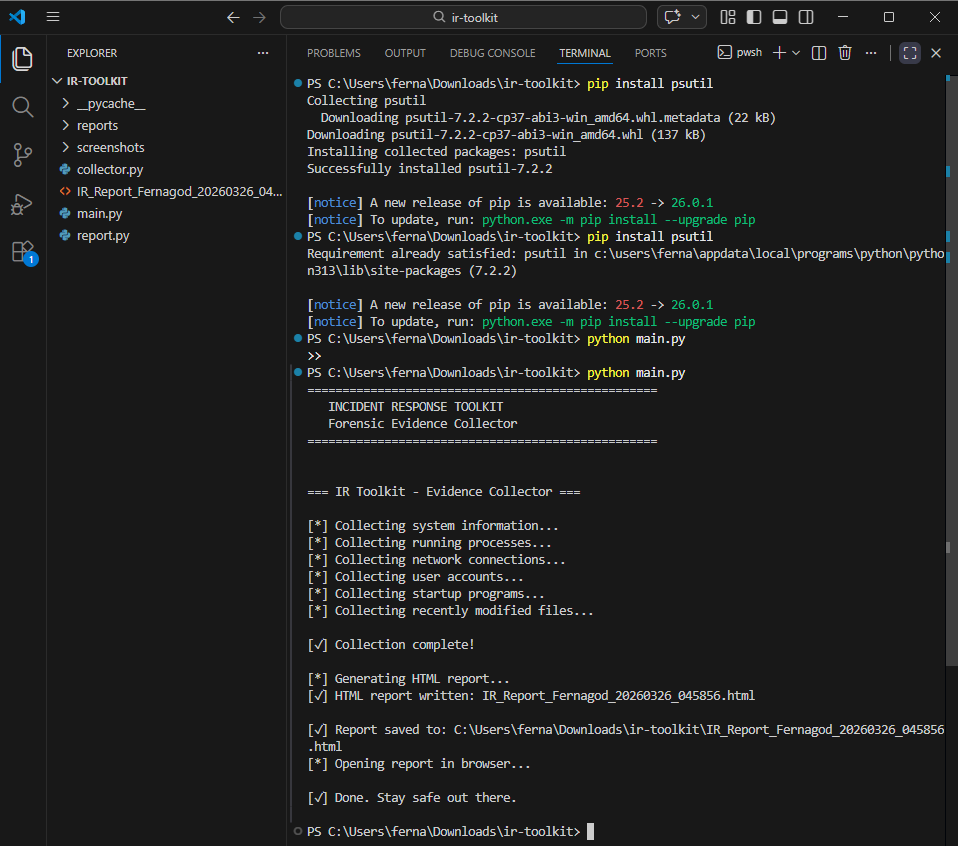

# 🛡️ Incident Response Toolkit

An automated forensic evidence collector for Windows systems.
Simulates what a real IR analyst runs when first responding to a
potentially compromised machine.

## 📋 What It Collects

- 🖥️ System information (hostname, OS, architecture)
- ⚙️ Running processes (sorted by memory usage)
- 🌐 Active network connections and open sockets
- 👤 Local user accounts
- 🔑 Startup programs (registry Run keys)
- 📁 Recently modified files (last 24 hours)

## 📸 Screenshots

**Report Header & Stats**


**Running Processes**


**Network Connections**


**Startup Programs**


**Recently Modified Files**


**Terminal Output**


## 🚀 How To Run

**Install dependencies:**
```bash
pip install psutil
```

**Run the toolkit:**
```bash
python main.py
```

The report will automatically open in your browser as a timestamped
HTML file — `IR_Report_HOSTNAME_TIMESTAMP.html`

## 🗂️ Project Structure
```
ir-toolkit/
├── main.py        # Entry point — orchestrates collection and report
├── collector.py   # Forensic data collection modules
├── report.py      # HTML report generator
└── screenshots/
```

## 🛠️ Built With

- Python 3
- psutil
- subprocess
- HTML/CSS (report generation)

## 💡 Purpose

Built as a portfolio project demonstrating incident response and
digital forensics concepts for a Cyber IA career path.